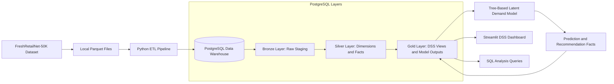
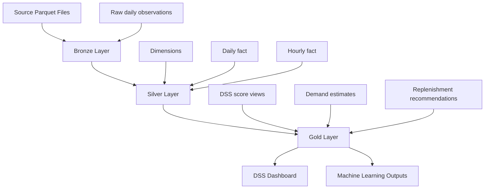
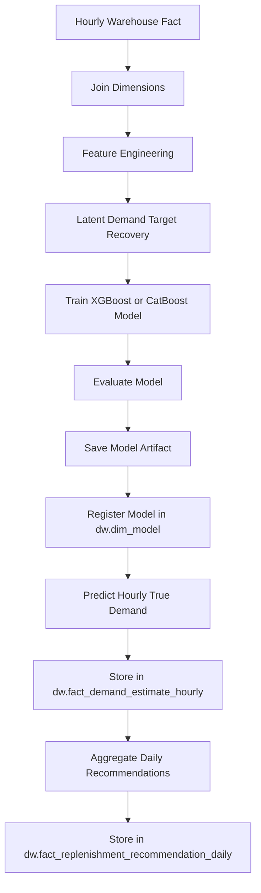
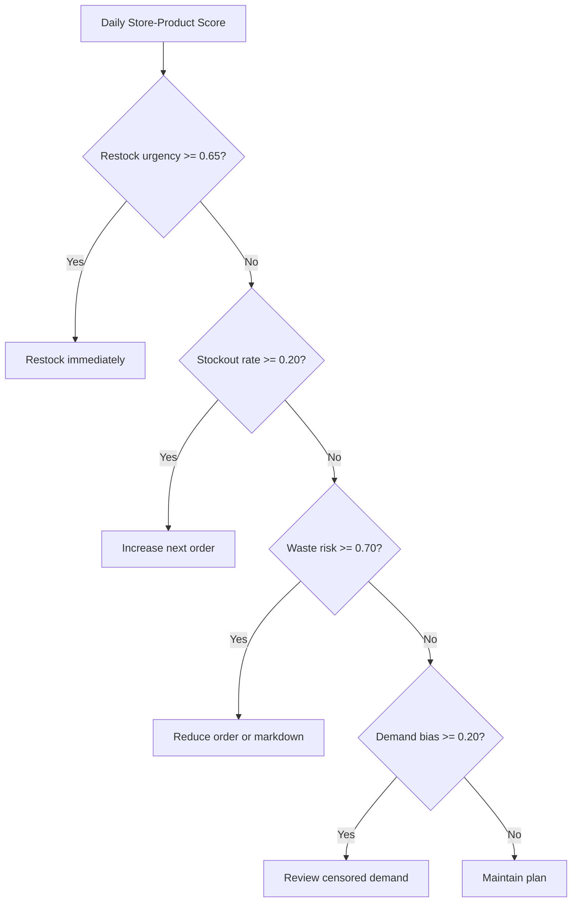
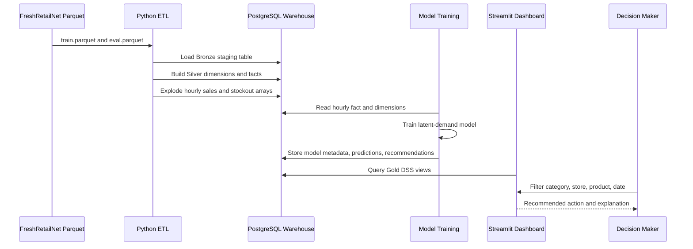

# Fresh Retail DSS Architecture

The data pipeline architecture supports data transformation, latent demand estimation, and decision support for fresh retail inventory management. The main business problem is censored demand: when a product is out of stock, observed sales drop to zero even though real customer demand may still exist.

The architecture is designed to support four DSS goals:

- Reduce stockout rate across product categories.
- Minimize product waste for perishable products.
- Enable faster restocking decisions.
- Reduce decision bias caused by censored stockout-period sales data.

## 1. Architecture Overview



## 2. Data Source and Ingestion

### Data Source

The initial data source is the `FreshRetailNet-50K` dataset from Hugging Face:

```text
https://huggingface.co/datasets/Dingdong-Inc/FreshRetailNet-50K
```

The dataset contains two parquet files:

| File | Purpose | Rows |
|---|---|---:|
| `FreshRetailNet-50K/data/train.parquet` | Training period | 4,500,000 |
| `FreshRetailNet-50K/data/eval.parquet` | Evaluation period | 350,000 |

The two files have the same schema and are concatenated into one staging table with an additional `source_split` column.

### Ingestion Method

Data is loaded into PostgreSQL using a Python ETL script:

```text
etl/load_fresh_retail_dw.py
```

The script uses:

| Tool | Purpose |
|---|---|
| `pyarrow` | Read parquet files efficiently in batches |
| `pandas` | Convert and prepare batch data |
| `psycopg` | Bulk load data into PostgreSQL using `COPY` |
| `uv` | Install and manage Python dependencies |

The ingestion process preserves raw source fields such as `hours_sale` and `hours_stock_status` in the Bronze layer for auditability.

## 3. Data Transformation Layers

The warehouse follows a staged architecture with Bronze, Silver, and Gold layers.



### Bronze Layer: Raw Staging

The Bronze layer stores raw merged data from `train.parquet` and `eval.parquet`.

Schema:

```text
staging
```

Main table:

```text
staging.fresh_retail_observation_day
```

Grain:

```text
source_split + store_id + product_id + dt
```

Purpose:

- Preserve source data structure.
- Keep hourly arrays unchanged for auditability.
- Track whether a row came from `train` or `eval`.
- Provide a reloadable source for dimensional transformations.

Important columns:

| Column | Description |
|---|---|
| `source_split` | `train` or `eval` |
| `store_id` | Encoded store id |
| `product_id` | Encoded product id |
| `dt` | Observation date |
| `sale_amount` | Observed daily sales |
| `hours_sale` | 24 hourly sales values |
| `hours_stock_status` | 24 hourly stockout flags |
| `discount` | Discount rate |
| `holiday_flag` | Holiday indicator |
| `activity_flag` | Promotion/activity indicator |
| `precpt`, `avg_temperature`, `avg_humidity`, `avg_wind_level` | Weather context |

### Silver Layer: Cleaned Dimensional Warehouse

The Silver layer converts raw staged data into clean, queryable dimensional tables and facts.

Schema:

```text
dw
```

Dimensions:

| Table | Purpose |
|---|---|
| `dw.dim_date` | Date attributes, weekend flag, holiday flag |
| `dw.dim_time` | Hour attributes and business-hour flag |
| `dw.dim_city` | City dimension |
| `dw.dim_store` | Store dimension linked to city |
| `dw.dim_product` | Product and category hierarchy |
| `dw.dim_model` | Trained model metadata |

Facts:

| Table | Grain | Purpose |
|---|---|---|
| `dw.fact_sales_inventory_daily` | Store-product-date | Daily sales and stockout summary |
| `dw.fact_sales_inventory_hourly` | Store-product-date-hour | Hourly sales and stockout status |

The hourly fact is created by exploding the two 24-element arrays:

```text
hours_sale[0..23]
hours_stock_status[0..23]
```

This is important because censored demand happens at the hourly level. Daily sales alone cannot tell which hours were affected by stockout.

### Gold Layer: DSS and Model Output Layer

The Gold layer contains business-facing outputs optimized for DSS analysis, dashboards, and decision making.

Gold fact tables:

| Table | Purpose |
|---|---|
| `dw.fact_demand_estimate_hourly` | Stores hourly model-estimated true demand and lost sales |
| `dw.fact_replenishment_recommendation_daily` | Stores daily recommended order quantities and risk scores |

Gold views:

| View | Purpose |
|---|---|
| `dw.v_latest_model` | Selects the latest trained model |
| `dw.v_dss_hourly_demand_estimate` | Combines model predictions or fallback heuristic estimates |
| `dw.v_dss_daily_decision_score` | Produces daily decision actions and DSS scores |
| `dw.v_dss_kpi_by_day` | Aggregates DSS KPIs by day |
| `dw.v_dss_kpi_by_category` | Aggregates DSS KPIs by product category |
| `dw.v_daily_restock_monitor` | Operational restocking watchlist |
| `dw.v_stockout_rate_by_category` | Category-level stockout analysis |

## 4. Data Transformation Tools

The current implementation uses Python and SQL scripts for transformations.

| Tool | Current Role |
|---|---|
| Python | Orchestrates ETL and ML training |
| SQL | Defines warehouse schema, dimensions, facts, and DSS views |
| PostgreSQL | Stores all warehouse layers and analytical outputs |
| Docker Compose | Runs PostgreSQL consistently |
| Streamlit | Provides interactive DSS dashboard |

Current transformation files:

| File | Purpose |
|---|---|
| `sql/001_schema.sql` | Creates schemas, tables, indexes, and DSS views |
| `sql/002_sample_queries.sql` | Example analytical queries |
| `etl/load_fresh_retail_dw.py` | Loads parquet data into PostgreSQL and builds facts |
| `ml/train_xgboost_demand_model.py` | Trains model and stores DSS predictions |

Comment:

The project currently does not use `dbt`. The same Bronze/Silver/Gold structure could be migrated to dbt later by converting the SQL transformations into dbt models.

## 5. Machine Learning Layer

The ML layer trains a demand model to reduce censored-demand bias.

Training script:

```text
ml/train_xgboost_demand_model.py
```

Model:

```text
Tree-based latent-demand regression model, currently XGBoost or CatBoost
```

Input source:

```text
dw.fact_sales_inventory_hourly
```

Joined with:

```text
dw.dim_date
dw.dim_store
dw.dim_city
dw.dim_product
```

### ML Flow



### Feature Engineering

The model uses features from product, store, time, promotion, discount, holiday, and weather context.

Examples:

| Feature Group | Examples |
|---|---|
| Time | `time_key`, `day_of_week`, `is_weekend`, `holiday_flag` |
| Store | `store_id`, `city_id` |
| Product | `product_id`, `first_category_id`, `second_category_id`, `third_category_id` |
| Commercial | `discount_rate`, `activity_flag` |
| Weather | `precpt`, `avg_temperature`, `avg_humidity`, `avg_wind_level` |

### Target Recovery

For non-stockout hours:

```text
latent_demand_target = observed_sales_amount
```

For stockout hours:

```text
latent_demand_target = max(observed_sales_amount, historical_non_stockout_baseline)
```

This gives the model a better approximation of true demand than raw censored sales.

## 6. Analysis and Reporting

The processed data is used by two main components.

### Machine Learning Model

The trained model estimates:

- True demand during normal and stockout periods.
- Lost sales caused by stockout censoring.
- Daily expected demand.
- Daily recommended order quantity.
- Stockout risk score.
- Waste risk proxy.

Model outputs are stored in:

```text
dw.fact_demand_estimate_hourly
dw.fact_replenishment_recommendation_daily
```

### Streamlit DSS Dashboard

Dashboard file:

```text
app/dss_dashboard.py
```

The dashboard reads from:

```text
dw.v_dss_daily_decision_score
```

Dashboard users can filter by:

- Date range.
- First category.
- Store.
- Product.
- Decision action.

Dashboard outputs:

| Dashboard Section | Meaning |
|---|---|
| Four DSS Criteria | Overall stockout, waste, bias, and urgency KPIs |
| Decision Trend | Daily movement of DSS risk scores |
| Top Category Pressure | Categories with highest restock or stockout pressure |
| Recommended Actions | Ranked recommendations with explanation |

## 7. Decision Support Logic

The DSS generates five possible actions.



Decision metrics:

| Metric | Formula / Meaning |
|---|---|
| `stockout_rate_6_22` | `stockout_hours_6_22 / 16` |
| `demand_bias_rate` | `estimated_lost_sales / estimated_true_demand` |
| `waste_risk_score` | Low-sales and no-stockout overstock proxy |
| `restock_urgency_score` | Weighted score from stockout, demand bias, and activity |

Urgency formula:

```text
restock_urgency_score = min(1,
    stockout_rate_6_22 * 0.55
    + demand_bias_rate * 0.35
    + activity_boost * 0.10
)
```

## 8. Containerization

Docker Compose is used to provide a consistent PostgreSQL environment.

File:

```text
docker-compose.yml
```

Container:

```text
fresh_retail_dw_postgres
```

Benefits:

- Consistent database version across machines.
- Easy setup for demo and development.
- Reproducible environment for project grading.
- Simple reset and reload of the warehouse.

## 9. End-to-End Runtime Sequence



## 10. Current Implementation Status

| Component | Status |
|---|---|
| PostgreSQL Docker container | Implemented |
| Dataset hydration | Implemented |
| Data validation | Implemented |
| Bronze staging table | Implemented |
| Silver dimensions and facts | Implemented |
| Hourly fact expansion | Implemented |
| Gold DSS views | Implemented |
| XGBoost/CatBoost model training | Implemented from warehouse feature view, experimental quality |
| Model prediction storage | Implemented |
| Daily replenishment recommendation storage | Implemented |
| Streamlit DSS dashboard | Implemented |

Current practical load options:

| Mode | Rows Loaded Per Split | Total Daily Rows | Total Hourly Rows |
|---|---:|---:|---:|
| Fast demo | 1,000 | 2,000 | 48,000 |
| Larger practical sample | 10,000 | 20,000 | 480,000 |

The fast demo is the default for quick rebuilds during development. The larger sample is still practical on a laptop and better for model comparison.

Model-quality note:

```text
The DSS architecture is complete, but model quality should be reported as experimental. The current warehouse-native model trains only on non-stockout observations and evaluates on non-stockout rows, because true demand during stockout is unobserved.
```

See `docs/EVALUATION.md` for the detailed model comparison and limitations.

## 11. Key Commands

Start PostgreSQL:

```bash
docker compose up -d postgres
```

Install dependencies:

```bash
uv pip install -r requirements.txt
```

Load demo warehouse:

```bash
python3 etl/load_fresh_retail_dw.py --reset --limit-rows-per-split 10000 --load-hourly
```

Train model and store predictions:

```bash
python3 ml/train_xgboost_demand_model.py \
  --model-type xgboost \
  --model-name xgboost_demand_fast \
  --model-version fast_sample \
  --n-estimators 120 \
  --max-train-rows 24000 \
  --max-eval-rows 24000 \
  --load-predictions
```

RetailForecast-style comparison:

```bash
python3 ml/replicate_retailforecast_xgboost.py \
  --model-type catboost \
  --train-daily-rows 20000 \
  --eval-daily-rows 10000 \
  --n-estimators 200
```

Run dashboard:

```bash
streamlit run app/dss_dashboard.py
```

Inspect PostgreSQL:

```bash
docker compose exec postgres psql -U warehouse -d fresh_retail_dw
```

## 12. Architecture Comments

- The Bronze/Silver/Gold architecture preserves raw source data while producing optimized analytical models.
- Hourly facts are necessary because stockout censoring occurs at the hourly level.
- The model output is stored back into the warehouse, making predictions auditable and reusable by dashboards or SQL reports.
- The DSS dashboard is model-aware: it uses trained model predictions when available and falls back to heuristic estimates otherwise.
- Docker ensures the PostgreSQL warehouse is reproducible for development and demonstration.
- The architecture supports operational, managerial, and strategic decisions.
- For this macOS environment, Apple GPU acceleration is not used for the current tree models because XGBoost and CatBoost GPU paths expect NVIDIA CUDA. CPU-optimized CatBoost/XGBoost is the practical choice.
- The recommended report position is to present model training as integrated but experimental, not production-ready.

## 14. Implementation Log

See [docs/IMPLEMENTATION_LOG.md](docs/IMPLEMENTATION_LOG.md) for the concrete implementation record of what has been built and how the current workflow runs.

## 13. Possible Future Enhancements

| Enhancement | Benefit |
|---|---|
| Add dbt | Better maintainability for Bronze/Silver/Gold SQL transformations |
| Add Airflow or Dagster | Scheduled ETL and model retraining |
| Add Power BI | Business-friendly reporting layer |
| Train on full hourly dataset | Better model quality |
| Add model registry | Better model version governance |
| Add inventory capacity and shelf-life data | More realistic order quantity and waste optimization |

Overall, this architecture supports historical analysis, demand forecasting, stockout-risk detection, waste-risk monitoring, and explainable decision support for fresh retail inventory management.
