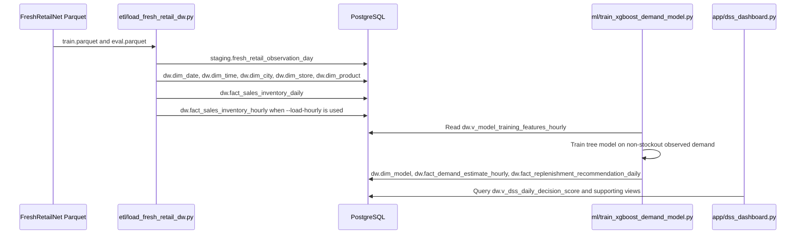

# Fresh Retail DSS Implementation Log

This document records what is currently implemented in `ubiquitous-train`, using the actual scripts, tables, and dashboard behavior in the repository.

## 1. What Was Built

The repository now implements an end-to-end warehouse and DSS pipeline for FreshRetailNet-50K:

1. PostgreSQL is started by Docker Compose.
2. The real `train.parquet` and `eval.parquet` files are hydrated locally.
3. `etl/load_fresh_retail_dw.py` loads the data into a Bronze staging table and builds Silver warehouse tables.
4. `sql/001_schema.sql` defines the schemas, tables, indexes, and DSS views.
5. `ml/train_xgboost_demand_model.py` trains a demand model from `dw.v_model_training_features_hourly` using non-stockout observations.
6. The model can write predictions into `dw.fact_demand_estimate_hourly` and daily recommendations into `dw.fact_replenishment_recommendation_daily`.
7. `app/dss_dashboard.py` reads the DSS views and shows the current decision-support dashboard.

## 2. Actual Runtime Sequence



## 3. Concrete Files And Responsibilities

| File | Current Role |
|---|---|
| `docker-compose.yml` | Starts PostgreSQL for the warehouse |
| `sql/001_schema.sql` | Creates schemas, warehouse tables, indexes, and DSS views |
| `etl/load_fresh_retail_dw.py` | Loads parquet data and builds daily/hourly facts |
| `ml/train_xgboost_demand_model.py` | Trains warehouse-native XGBoost or CatBoost demand models |
| `ml/replicate_retailforecast_xgboost.py` | Reproduces a RetailForecast-style comparison on local parquet data |
| `app/dss_dashboard.py` | Streamlit dashboard for DSS metrics, trends, and recommendations |
| `sql/002_sample_queries.sql` | Example SQL analysis queries |

## 4. Warehouse Layers In Practice

### Bronze

Raw merged data lands in `staging.fresh_retail_observation_day` with `source_split` set to `train` or `eval`.

### Silver

`dw.dim_date`, `dw.dim_time`, `dw.dim_city`, `dw.dim_store`, `dw.dim_product`, `dw.fact_sales_inventory_daily`, and `dw.fact_sales_inventory_hourly` are created from the staging table.

### Gold

`dw.dim_model`, `dw.fact_demand_estimate_hourly`, `dw.fact_replenishment_recommendation_daily`, and the DSS views provide the decision layer.

## 5. How The Model Layer Works

`ml/train_xgboost_demand_model.py` reads `dw.v_model_training_features_hourly`, which joins hourly facts with date, time, store, city, and product dimensions.

The training target is intentionally conservative:

- Only non-stockout rows are used for training.
- The target equals observed hourly sales, because those rows are least affected by stockout censoring.
- Predictions are written for all rows; non-stockout estimates keep observed sales, while stockout estimates use `max(observed_sales, predicted_demand)`.

The script supports `xgboost` and `catboost`. When `--load-predictions` is used, it also writes hourly predictions and daily replenishment recommendations back into PostgreSQL.

## 6. Dashboard Behavior

`app/dss_dashboard.py` reads `dw.v_dss_daily_decision_score` and related summary views.

Current behavior:

- If no hourly predictions exist yet, the dashboard falls back to the heuristic demand recovery logic embedded in the SQL views.
- If predictions exist, the dashboard uses the latest model that actually has rows in `dw.fact_demand_estimate_hourly`.
- Filters are applied by date range, first category, store, product, and decision action.
- Warehouse data quality checks are shown from `dw.v_data_quality_checks`.
- A selected recommendation can be drilled down by hour.
- What-if sliders recompute restock counts for different urgency thresholds and service-level targets.

## 7. Current Practical Load Sizes

The repo is designed for two useful load modes:

| Mode | Rows Loaded Per Split | Total Daily Rows | Total Hourly Rows |
|---|---:|---:|---:|
| Fast demo | 1,000 | 2,000 | 48,000 |
| Larger practical sample | 10,000 | 20,000 | 480,000 |

The fast demo is the best default for quick development and grading.

## 8. What Is Still Experimental

- The DSS flow is implemented end to end.
- The model quality is still experimental compared with production inventory planning needs.
- The repository also includes `ml/replicate_retailforecast_xgboost.py` for local comparison against the separate RetailForecast approach.
- The current project does not depend on dbt, Airflow, or a model registry.

## 9. Canonical Commands

Start PostgreSQL:

```bash
docker compose up -d postgres
```

Load the recommended local model panel:

```bash
uv run python etl/load_fresh_retail_dw.py \
  --reset \
  --train-limit-rows 100000 \
  --staging-sample-mode store-product-panel \
  --panel-seed 42 \
  --load-hourly \
  --hourly-workers 4
```

Train a model and load predictions:

```bash
uv run python ml/train_xgboost_demand_model.py \
  --model-type xgboost \
  --model-strategy hurdle \
  --model-name xgboost_demand_m1_hurdle \
  --model-version m1_panel100k_seed42_full_eval \
  --max-train-rows 2400000 \
  --n-estimators 300 \
  --max-depth 6 \
  --learning-rate 0.05 \
  --n-jobs 8 \
  --prior-blend-weight 0.5 \
  --calibration-objective balanced \
  --calibration-bias-penalty 0.25 \
  --max-calibration-factor 5 \
  --load-predictions
```

Run the dashboard:

```bash
streamlit run app/dss_dashboard.py
```
