# Fresh Retail DSS Project Flow

This document describes the end-to-end flow built for the FreshRetailNet-50K warehouse and decision support system. It covers data acquisition, validation, ETL, PostgreSQL warehouse design, model training, DSS output storage, and dashboard usage.

## 1. Project Goal

The DSS supports fresh retail inventory decisions under censored demand. Sales become unreliable during stockout periods because customers may still want the product even when observed sales are zero.

The system targets four decision criteria:

| Criteria | DSS Meaning | Main Output |
|---|---|---|
| Reduce stockout rate | Identify products/stores with repeated business-hour stockouts | `stockout_rate_6_22`, `stockout_risk_score` |
| Minimize waste | Detect slow-moving products with low sales and no stockout signal | `waste_risk_score`, `expected_waste_qty` |
| Faster restocking decisions | Produce ranked operational actions for staff/managers | `decision_action`, `restock_urgency_score` |
| Reduce censored-demand bias | Estimate latent demand and lost sales during stockouts | `estimated_true_demand`, `estimated_lost_sales`, `demand_bias_rate` |

## 2. High-Level Architecture

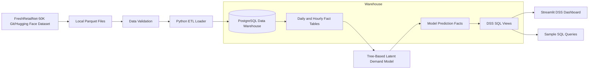

## 3. Repository Structure

```text
WarehouseDSS/
├── FreshRetailNet-50K/
│   ├── data/
│   │   ├── train.parquet
│   │   └── eval.parquet
│   └── README.md
├── RetailForecast/
│   ├── pipeline_final.ipynb
│   ├── serve_ensemble.py
│   └── app.py
├── app/
│   └── dss_dashboard.py
├── docs/
│   └── PROJECT_FLOW.md
├── etl/
│   └── load_fresh_retail_dw.py
├── ml/
│   └── train_xgboost_demand_model.py
├── models/
│   ├── xgboost_latent_demand_<version>.pkl
│   └── xgboost_latent_demand_<version>_metrics.json
├── sql/
│   ├── 001_schema.sql
│   └── 002_sample_queries.sql
├── docker-compose.yml
├── requirements.txt
└── README.md
```

## 4. Dataset Acquisition Flow

The local `FreshRetailNet-50K` repository already existed and pointed to Hugging Face:

```text
origin https://huggingface.co/datasets/Dingdong-Inc/FreshRetailNet-50K
```

Initially, `train.parquet` and `eval.parquet` were Git LFS pointer files, not real parquet data.

Because `git lfs` was not installed, the real parquet payloads were downloaded using `huggingface_hub`.

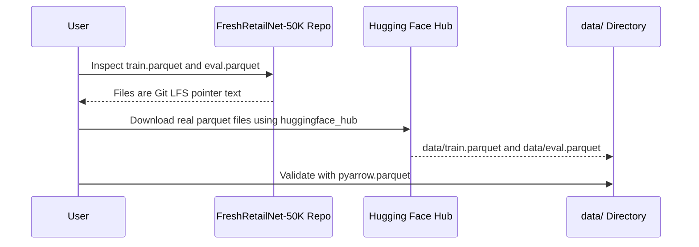

Validated files:

| File | Rows | Size |
|---|---:|---:|
| `data/train.parquet` | 4,500,000 | 106,436,287 bytes |
| `data/eval.parquet` | 350,000 | 8,440,124 bytes |

## 5. Data Validation Results

After hydrating the real parquet files, the data was rechecked with `pyarrow`.

### Schema

| Column | Type | Meaning |
|---|---|---|
| `city_id` | `int64` | Encoded city |
| `store_id` | `int64` | Encoded store |
| `management_group_id` | `int64` | Product hierarchy |
| `first_category_id` | `int64` | Product hierarchy |
| `second_category_id` | `int64` | Product hierarchy |
| `third_category_id` | `int64` | Product hierarchy |
| `product_id` | `int64` | Encoded product |
| `dt` | `string` | Date |
| `sale_amount` | `double` | Daily observed sales |
| `hours_sale` | `list<double>` | 24 hourly observed sales values |
| `stock_hour6_22_cnt` | `int32` | Stockout count from hour 6 through hour 21 |
| `hours_stock_status` | `list<int64>` | 24 hourly stockout flags |
| `discount` | `double` | Discount rate |
| `holiday_flag` | `int32` | Holiday indicator |
| `activity_flag` | `int32` | Promotion/activity indicator |
| `precpt` | `double` | Precipitation |
| `avg_temperature` | `double` | Average temperature |
| `avg_humidity` | `double` | Average humidity |
| `avg_wind_level` | `double` | Average wind level |

### Quality Checks

| Check | Result |
|---|---|
| `hours_sale` length | Always `24` |
| `hours_stock_status` length | Always `24` |
| `hours_stock_status` values | Only `0` and `1` |
| Null counts | No nulls found |
| Duplicate `store_id/product_id/dt` within split | `0` |
| Duplicate `store_id/product_id/dt` across splits | `0` |
| `sale_amount = sum(hours_sale)` | True for all checked rows |
| `stock_hour6_22_cnt = sum(hours_stock_status[6:22])` | True |

Date and entity ranges:

| Metric | Value |
|---|---:|
| Combined rows | 4,850,000 |
| Date range | 2024-03-28 to 2024-07-02 |
| Unique cities | 18 |
| Unique stores | 898 |
| Unique products | 865 |
| Unique dates | 97 |

Important detail: `stock_hour6_22_cnt` matches hours `6..21`, not `6..22` inclusive. This means the business-hour denominator is `16` hours.

## 6. PostgreSQL Warehouse Setup

PostgreSQL is managed by Docker Compose.

File:

```text
docker-compose.yml
```

Service:

```text
container: fresh_retail_dw_postgres
image: postgres:16-alpine
database: fresh_retail_dw
user: warehouse
password: warehouse
host port: 5433
container port: 5432
```

Start command:

```bash
docker compose up -d postgres
```

Connect command:

```bash
docker compose exec postgres psql -U warehouse -d fresh_retail_dw
```

## 7. Warehouse Data Model

The warehouse has two schemas:

| Schema | Purpose |
|---|---|
| `staging` | Raw merged source data from train/eval parquet files |
| `dw` | Dimensional warehouse, model outputs, recommendation facts, and DSS views |

### Entity Relationship Diagram

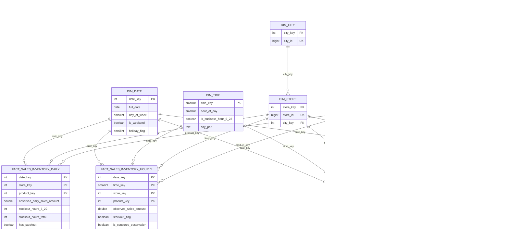

## 8. ETL Pipeline

ETL script:

```text
etl/load_fresh_retail_dw.py
```

### ETL Flow

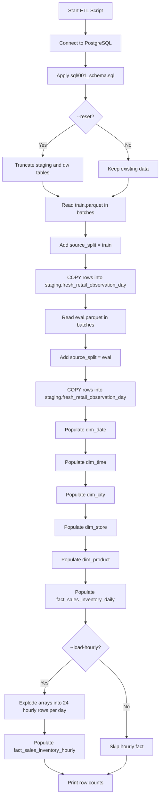

### Main ETL Decisions

1. `train.parquet` and `eval.parquet` are concatenated, not joined.
2. A `source_split` column is added to preserve lineage.
3. The staging grain is one row per `source_split`, `store_id`, `product_id`, `dt`.
4. The daily fact grain is one row per `store`, `product`, `date`.
5. The hourly fact grain is one row per `store`, `product`, `date`, `hour`.
6. Hourly loading is optional because full data expands to about `116.4M` rows.

### ETL Commands

Apply schema only:

```bash
python3 etl/load_fresh_retail_dw.py --schema-only
```

Fast demo load:

```bash
python3 etl/load_fresh_retail_dw.py --reset --limit-rows-per-split 10000
```

Fast demo load with hourly fact:

```bash
python3 etl/load_fresh_retail_dw.py --reset --limit-rows-per-split 10000 --load-hourly
```

Full daily warehouse:

```bash
python3 etl/load_fresh_retail_dw.py --reset
```

Full hourly warehouse:

```bash
python3 etl/load_fresh_retail_dw.py --reset --load-hourly
```

### Current Demo Load Options

The repository supports two practical warehouse load sizes:

| Mode | Command Shape | Total Daily Rows | Total Hourly Rows |
|---|---|---:|---:|
| Fast demo | `--limit-rows-per-split 1000 --load-hourly` | 2,000 | 48,000 |
| Larger practical sample | `--limit-rows-per-split 10000 --load-hourly` | 20,000 | 480,000 |

The fast demo is intended for quick rebuilds during development. The larger sample is still manageable on a laptop and gives the model a broader training base.

## 9. DSS Views Before Model Training

The initial DSS used explainable heuristic demand recovery as a fallback.

Main views:

| View | Purpose |
|---|---|
| `dw.v_daily_restock_monitor` | Operational restock watchlist |
| `dw.v_stockout_rate_by_category` | Category stockout summary |
| `dw.v_dss_hourly_demand_estimate` | Hourly true-demand/lost-sales estimate |
| `dw.v_dss_daily_decision_score` | Daily DSS decision score and action |
| `dw.v_dss_kpi_by_day` | Daily KPI aggregation |
| `dw.v_dss_kpi_by_category` | Category KPI aggregation |

Fallback logic:

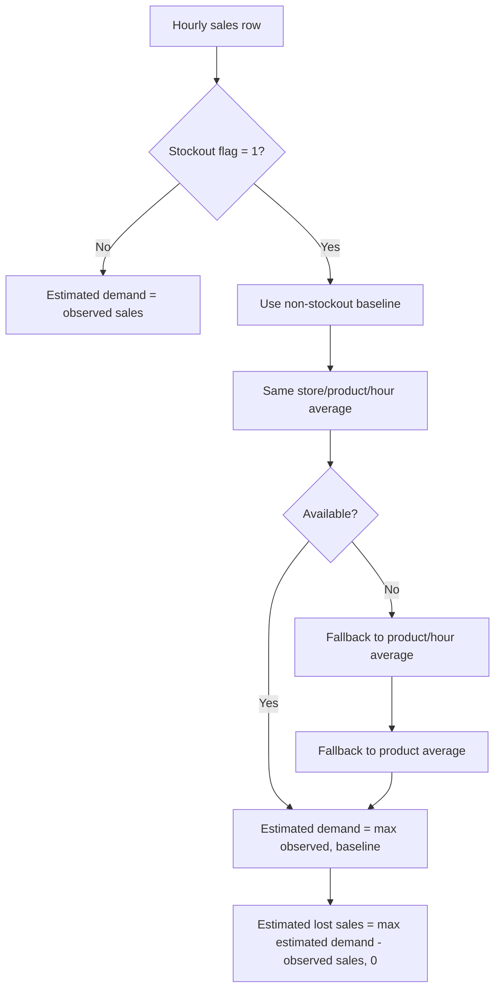

This is transparent and useful for explanation, but not enough for final real decisions. Therefore, a trained model was added.

## 10. RetailForecast Repository Inspection

Repository cloned:

```text
RetailForecast/
```

Important files:

| File | Purpose |
|---|---|
| `pipeline_final.ipynb` | Notebook pipeline for data preparation, imputation, XGBoost, Chronos, and stacking |
| `serve_ensemble.py` | Ray Serve API for XGBoost/Chronos ensemble inference |
| `app.py` | Original forecast dashboard |
| `requirements.txt` | Heavy ML dependencies |

Finding:

The notebook is useful conceptually, but it is not a clean production script. Chronos and SAITS are also heavy for this project demo. A warehouse-native tree-model training script was therefore added to integrate directly with PostgreSQL and the DSS schema. A RetailForecast-style replication script was also added for local comparison.

## 11. Model Training Pipeline

Training script:

```text
ml/train_xgboost_demand_model.py
```

The model layer supports XGBoost and CatBoost demand estimators trained from `dw.v_model_training_features_hourly`. The default project path is XGBoost with CPU histogram training, which runs natively on Apple Silicon and does not require CUDA or MPS.

### Training Flow

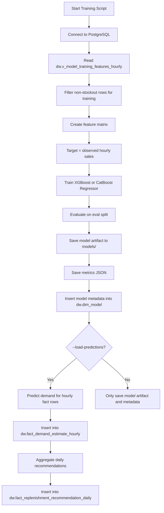

### Feature Columns

The model uses warehouse-derived features:

| Feature | Source |
|---|---|
| `hour_of_day` | `dw.dim_time` |
| `is_business_hour_6_22` | `dw.dim_time` |
| `day_of_week` | `dw.dim_date` |
| `is_weekend` | `dw.dim_date` |
| `holiday_flag` | `dw.dim_date` |
| `activity_flag` | `dw.fact_sales_inventory_hourly` |
| `discount_rate` | `dw.fact_sales_inventory_hourly` |
| `precpt` | `dw.fact_sales_inventory_hourly` |
| `avg_temperature` | `dw.fact_sales_inventory_hourly` |
| `avg_humidity` | `dw.fact_sales_inventory_hourly` |
| `avg_wind_level` | `dw.fact_sales_inventory_hourly` |
| `city_id` | `dw.dim_city` |
| `store_id` | `dw.dim_store` |
| `product_id` | `dw.dim_product` |
| `management_group_id` | `dw.dim_product` |
| `first_category_id` | `dw.dim_product` |
| `second_category_id` | `dw.dim_product` |
| `third_category_id` | `dw.dim_product` |

### Target Construction

Observed sales are censored during stockouts, so the model is trained only where observed sales are most reliable:

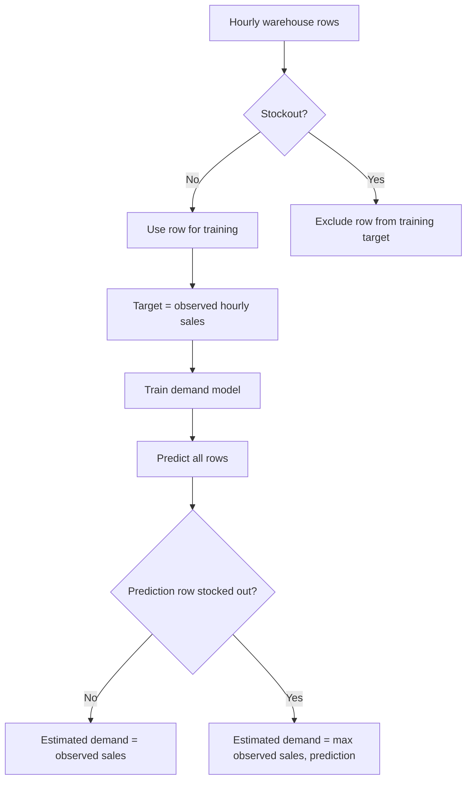

The SQL heuristic baseline remains the explainable fallback when no model predictions exist. The heuristic fallback order is store-product-hour, product-hour, category-hour, product average, then global hour average.

### Training Command

```bash
python3 ml/train_xgboost_demand_model.py --load-predictions
```

For larger training:

```bash
python3 ml/train_xgboost_demand_model.py --max-train-rows 1000000 --load-predictions
```

## 12. Current Model Evaluation

The current DSS model layer is integrated and runnable, but model quality is still experimental.

Current quick warehouse model metadata:

| Field | Value |
|---|---|
| `model_name` | `xgboost_demand_fast` |
| `model_version` | `smoke_m1` |
| Training start | 2024-03-28 |
| Training end | 2024-06-25 |

Important evaluation caveat:

```text
Model metrics are evaluated only on non-stockout rows because true demand during stockout is unobserved. The model is suitable for demonstrating warehouse-to-DSS integration, not production-grade ordering optimization.
```

Current M1 smoke XGBoost metrics:

| Metric | Value |
|---|---:|
| Evaluation rows | 5,000 |
| MAE | 0.0603 |
| RMSE | 0.0974 |
| WMAPE | 1.2536 |
| Bias | -17.78% |

Best local RetailForecast-style replication result:

| Model | Target | Eval rows | WMAPE | Bias |
|---|---|---:|---:|---:|
| CatBoost | latent baseline | 240,000 | 67.69% | +29.65% |

See `docs/EVALUATION.md` for the full model comparison.

Artifacts:

```text
models/xgboost_demand_fast_smoke_m1.pkl
models/xgboost_demand_fast_smoke_m1_metrics.json
```

## 13. Model Output Storage

The trained model does not only produce a file. Its predictions are loaded back into PostgreSQL.

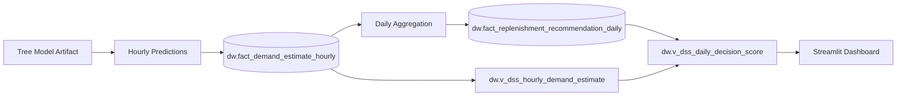

Current model output counts:

| Table | Rows |
|---|---:|
| `dw.fact_demand_estimate_hourly` | 480,000 |
| `dw.fact_replenishment_recommendation_daily` | 20,000 |

### Hourly Prediction Fact

Table:

```text
dw.fact_demand_estimate_hourly
```

Stores:

| Column | Meaning |
|---|---|
| `date_key` | Date FK |
| `time_key` | Hour FK |
| `store_key` | Store FK |
| `product_key` | Product FK |
| `model_key` | Model FK |
| `observed_sales_amount` | Actual observed hourly sales |
| `estimated_true_demand` | Model-estimated latent demand |
| `estimated_lost_sales` | Lost demand caused by stockout censoring |
| `stockout_flag` | Whether product was stocked out |
| `is_censored_observation` | Whether observed sales may be biased |
| `prediction_lower_bound` | Simple lower bound |
| `prediction_upper_bound` | Simple upper bound |

### Daily Recommendation Fact

Table:

```text
dw.fact_replenishment_recommendation_daily
```

Stores:

| Column | Meaning |
|---|---|
| `recommended_order_qty` | Suggested quantity based on expected demand/lost sales |
| `expected_demand` | Daily model-estimated demand |
| `expected_lost_sales` | Daily model-estimated lost sales |
| `stockout_risk_score` | Stockout risk between 0 and 1 |
| `expected_waste_qty` | Waste risk quantity proxy |
| `service_level_target` | Target service level, currently 0.95 |

## 14. Model-Aware DSS Views

The DSS views now prefer trained model predictions when available.

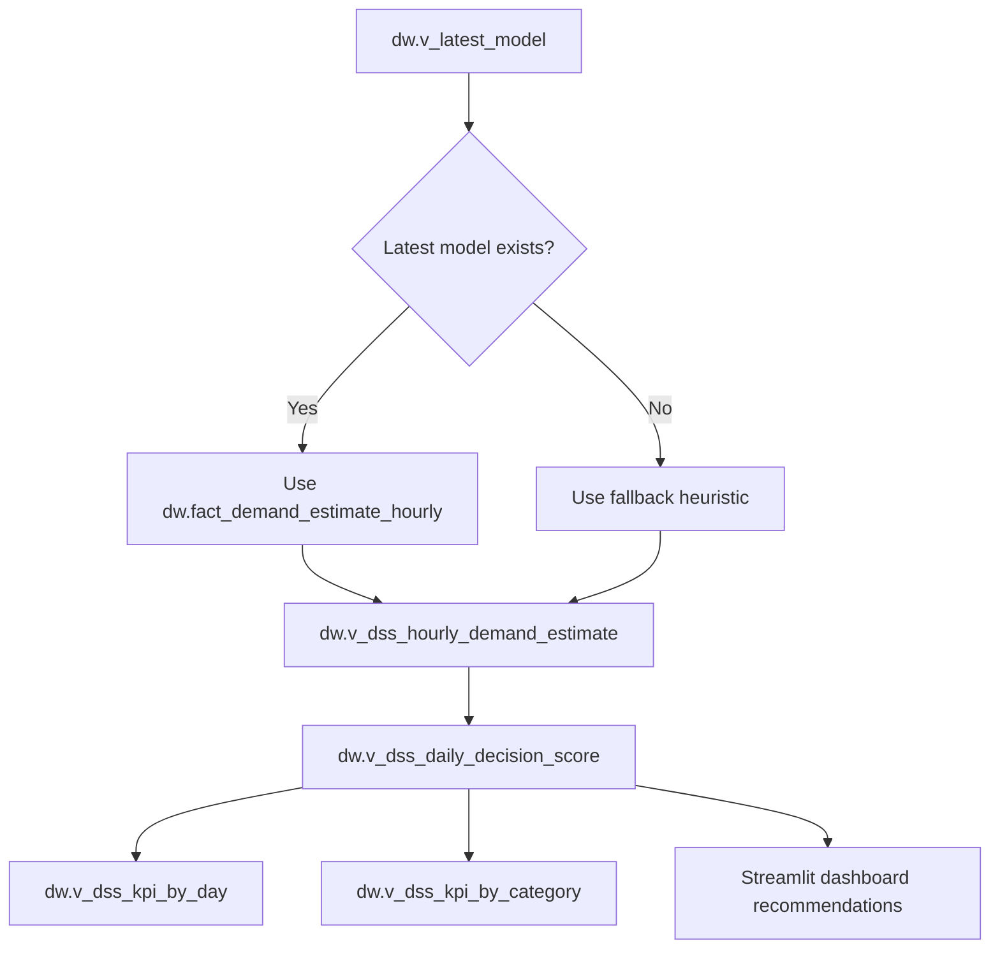

Main DSS decision fields:

| Field | Meaning |
|---|---|
| `estimated_true_demand` | Demand estimate after correcting stockout censoring |
| `estimated_lost_sales` | Demand likely lost during stockouts |
| `stockout_rate_6_22` | Business-hour stockout rate |
| `demand_bias_rate` | Lost sales divided by estimated demand |
| `waste_risk_score` | Slow-moving/no-stockout waste proxy |
| `restock_urgency_score` | Combined priority score |
| `decision_action` | DSS recommended action |
| `decision_reason` | Explainable reason for the recommendation |

## 15. Decision Logic

Daily DSS action logic:

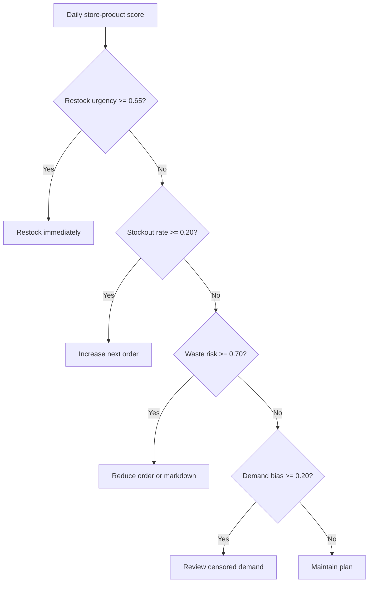

Current model-based action distribution:

| Decision Action | Count |
|---|---:|
| Maintain plan | 11,751 |
| Increase next order | 5,554 |
| Restock immediately | 1,580 |
| Reduce order or markdown | 835 |
| Review censored demand | 280 |

### Why Some Dashboard Rows Show 100%

The dashboard uses progress bars for normalized scores between `0` and `1`. Streamlit renders `1.0` as `100%`.

For the highest-priority rows, it is correct to see `100%` for demand bias, stockout, and urgency when all of these conditions are true:

1. `stockout_hours_6_22 = 16`
2. `observed_daily_sales_amount = 0`
3. The trained model estimates positive demand
4. `activity_flag = 1`, which adds the final urgency boost

Example from the current warehouse:

| Date | Store | Product | Observed Sales | Estimated Demand | Lost Sales | Stockout Hours | Stockout | Demand Bias | Activity | Urgency | Action |
|---|---:|---:|---:|---:|---:|---:|---:|---:|---:|---:|---|
| 2024-06-18 | 0 | 691 | 0.0000 | 4.8946 | 4.8946 | 16 | 100% | 100% | 1 | 100% | Restock immediately |

The formulas explain this result:

```text
stockout_rate_6_22 = stockout_hours_6_22 / 16
                   = 16 / 16
                   = 1.0 = 100%

demand_bias_rate = estimated_lost_sales / estimated_true_demand
                 = 4.8946 / 4.8946
                 = 1.0 = 100%

restock_urgency_score = min(1,
    stockout_rate_6_22 * 0.55
    + demand_bias_rate * 0.35
    + activity_boost * 0.10
)

restock_urgency_score = min(1, 1.0 * 0.55 + 1.0 * 0.35 + 1.0 * 0.10)
                      = min(1, 1.0)
                      = 1.0 = 100%
```

Interpretation:

This is not a display bug. It means the model believes customers likely wanted the product, but the store had no stock during all business hours, so observed sales were fully censored. These rows are correctly ranked as `Restock immediately`.

## 16. Streamlit DSS Dashboard

Dashboard file:

```text
app/dss_dashboard.py
```

Run command:

```bash
streamlit run app/dss_dashboard.py
```

Dashboard inputs:

| Filter | Purpose |
|---|---|
| Date range | Select analysis period |
| First category | Category manager view |
| Store | Operational store-level view |
| Product | SKU-level analysis |
| Decision action | Focus on specific recommendations |

Dashboard outputs:

| Section | Shows |
|---|---|
| Model status | Latest trained model and prediction counts |
| Four DSS criteria | Stockout, waste, restock urgency, demand bias KPIs |
| Decision trend | Daily trend of DSS criteria |
| Top category pressure | Highest-risk categories |
| Recommended actions | Ranked store-product-date actions with reasons |

Dashboard data source:

```text
dw.v_dss_daily_decision_score
```

## 17. End-to-End Runtime Flow

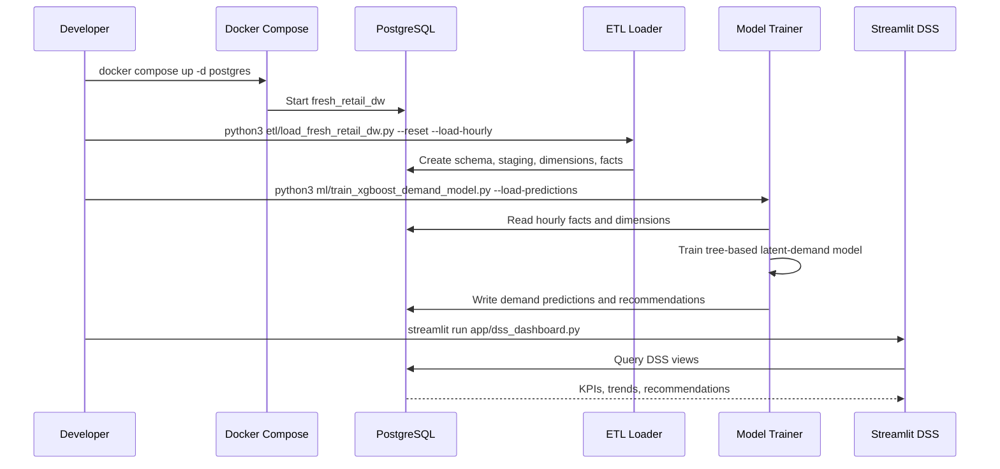

## 18. Key Commands

Install dependencies:

```bash
uv pip install -r requirements.txt
```

Start PostgreSQL:

```bash
docker compose up -d postgres
```

Load fast demo warehouse with hourly facts:

```bash
python3 etl/load_fresh_retail_dw.py --reset --limit-rows-per-split 1000 --load-hourly
```

Train model and store DSS predictions:

```bash
python3 ml/train_xgboost_demand_model.py \
  --model-type xgboost \
  --model-name xgboost_demand_fast \
  --model-version fast_sample \
  --n-estimators 120 \
  --max-depth 6 \
  --learning-rate 0.08 \
  --max-train-rows 24000 \
  --max-eval-rows 24000 \
  --load-predictions
```

Run dashboard:

```bash
streamlit run app/dss_dashboard.py
```

Inspect model outputs:

```bash
docker compose exec postgres psql -U warehouse -d fresh_retail_dw
```

```sql
SELECT * FROM dw.dim_model;

SELECT *
FROM dw.fact_demand_estimate_hourly
LIMIT 10;

SELECT *
FROM dw.fact_replenishment_recommendation_daily
LIMIT 10;

SELECT decision_action, COUNT(*)
FROM dw.v_dss_daily_decision_score
GROUP BY decision_action
ORDER BY COUNT(*) DESC;
```

## 19. What Is Real vs Demo

Current state:

| Component | Status |
|---|---|
| PostgreSQL warehouse | Running |
| Dataset parquet files | Real hydrated parquet files |
| Demo ETL load | Complete |
| Hourly fact load | Complete for demo sample |
| CatBoost/XGBoost model training | Integrated, experimental model quality |
| Model predictions | Stored in warehouse |
| DSS dashboard | Running-ready |

Demo limitation:

The current fast demo warehouse uses `1,000` rows from train and `1,000` rows from eval. This is enough to demonstrate the complete flow quickly. A larger `10,000` rows per split sample is better for a presentation if runtime allows.

Recommended practical run:

```bash
python3 etl/load_fresh_retail_dw.py --reset --limit-rows-per-split 10000 --load-hourly
python3 ml/train_xgboost_demand_model.py --model-type catboost --model-name catboost_latent_demand --model-version practical_sample --n-estimators 200 --max-train-rows 240000 --max-eval-rows 240000 --load-predictions
streamlit run app/dss_dashboard.py
```

## 20. Summary

The project now has a complete DSS flow:

1. Hydrate and validate FreshRetailNet-50K parquet data.
2. Load merged `train` and `eval` data into PostgreSQL staging.
3. Build dimensional warehouse tables and daily/hourly fact tables.
4. Train a tree-based latent-demand model from hourly warehouse facts.
5. Store hourly demand estimates and daily replenishment recommendations in the warehouse.
6. Expose explainable DSS scores and actions through SQL views.
7. Display model-based decisions in a Streamlit dashboard.
